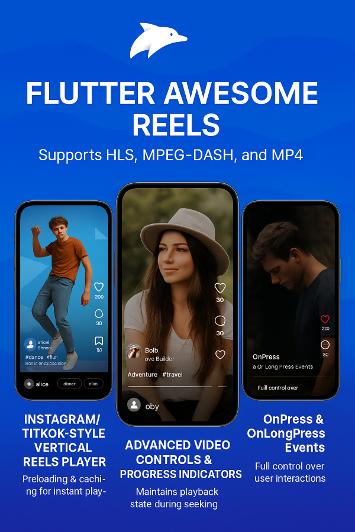

# Flutter Awesome Reels

A powerful and feature-rich Flutter package for creating Instagram/TikTok-like video reels with advanced streaming support including HLS, DASH, and MP4 formats.




## ⚠️ Breaking Changes
- **Multi-Format Video Support**: Now supports HLS, MPEG-DASH, and MP4 video sources. Update your video URLs and backend delivery as needed.
- **New Event Callbacks**: Added `onPress` and `onLongPress` event callbacks for advanced interaction handling. Update your widget usage to handle these events if needed.

## Features

### 🎥 Video Streaming Support
- **HLS (HTTP Live Streaming)** - Adaptive bitrate streaming with excellent iOS support
- **DASH (Dynamic Adaptive Streaming)** - High-quality streaming with broad compatibility
- **MP4** - Standard video format with universal support
- **Auto-format selection** - Intelligent format selection based on platform and network conditions
- **Fallback support** - Automatic fallback to alternative formats if primary format fails

### 📱 Platform Optimized
- **iOS**: Optimized for HLS streaming
- **Android**: Optimized for DASH streaming
- **Web**: Universal MP4 support
- **Hardware acceleration** support
- **Picture-in-Picture** mode

### ⚡ Performance Features
- **Adaptive bitrate streaming** for optimal quality based on network conditions
- **Intelligent caching** with configurable cache size and duration
- **Video preloading** for smooth playback experience
- **Memory management** with automatic controller cleanup
- **Low latency streaming** support for live content

### 🎨 UI/UX Features
- **Instagram-like interface** with familiar gestures
- **Customizable progress indicators**
- **Shimmer loading effects**
- **Error handling** with retry functionality
- **Play/pause animations**
- **Double-tap to like** with heart animation
- **Long press to pause**

### 🔧 Advanced Configuration
- **Streaming quality control** (bitrate limits, resolution)
- **Subtitle and audio track selection**
- **DRM support** for protected content
- **Network timeout and retry configuration**
- **Custom error and loading widgets**

## Installation

Add this to your package's `pubspec.yaml` file:

```yaml
dependencies:
  flutter_awesome_reels: ^0.0.3
```

Then run:

```bash
flutter pub get
```

## Quick Start

### Basic Usage

```dart
import 'package:flutter/material.dart';
import 'package:flutter_awesome_reels/flutter_awesome_reels.dart';

class MyReelsPage extends StatefulWidget {
  @override
  _MyReelsPageState createState() => _MyReelsPageState();
}

class _MyReelsPageState extends State<MyReelsPage> {
  late ReelController _controller;

  @override
  void initState() {
    super.initState();
    // Create reels with different streaming formats
    final reels = [
      ReelModel(
        id: '4',
        videoSource: VideoSource(
          url: 'https://bitmovin-a.akamaihd.net/content/MI201109210084_1/mpds/f08e80da-bf1d-4e3d-8899-f0f6155f6efa.mpd',
        ),
        user: const ReelUser(
          id: 'u2',
          username: 'bob',
          displayName: 'Bob Builder',
          isFollowing: true,
        ),
        likesCount: 200,
        commentsCount: 30,
        sharesCount: 10,
        tags: ['adventure', 'travel'],
        audio: const ReelAudio(title: 'Adventure Tune'),
        duration: const Duration(seconds: 20),
        isLiked: true,
        views: 2500,
        location: 'Mountains',
      ),
      ReelModel(
        id: '1',
        videoSource: VideoSource(
          url: 'https://demo.unified-streaming.com/k8s/features/stable/video/tears-of-steel/tears-of-steel.ism/.m3u8',
        ),
        user: const ReelUser(
          id: 'u3',
          username: 'charlie',
          displayName: 'Charlie Chaplin',
        ),
        likesCount: 4325,
        commentsCount: 45,
        sharesCount: 20,
        tags: ['comedy', 'classic'],
        audio: const ReelAudio(title: 'Classic Comedy'),
        duration: const Duration(seconds: 15),
        isLiked: false,
        views: 5000,
        location: 'Hollywood',
      ),
      ReelModel(
        id: '3',
        videoSource: VideoSource(
          url: 'https://www.sample-videos.com/video321/mp4/720/big_buck_bunny_720p_1mb.mp4',
        ),
        user: const ReelUser(
          id: 'u1',
          username: 'alice',
          displayName: 'Alice in Wonderland',
        ),
        likesCount: 120,
        commentsCount: 15,
        sharesCount: 5,
        tags: ['fun', 'bunny'],
        audio: const ReelAudio(title: 'Sample Music'),
        duration: const Duration(seconds: 10),
        isLiked: false,
        views: 1000,
        location: 'Wonderland',
      ),
    ];
    _controller = ReelController();
    _controller.initialize(reels: reels, config: ReelConfig());
  }

  @override
  Widget build(BuildContext context) {
    return Scaffold(
      body: AwesomeReels(
        reels: _controller.reels,
        controller: _controller,
        config: ReelConfig(
          showDownloadButton: false,
          enablePullToRefresh: true,
        ),
        onReelChanged: (index) {
          debugPrint('Reel changed to index: $index');
        },
        onReelLiked: (reel) {
          _showSnackBar(
              '[${reel.isLiked ? 'Liked' : 'Unliked'} ${reel.user?.displayName}\'s reel');
        },
        onReelShared: (reel) {
          _showSnackBar('Shared ${reel.user?.displayName}\'s reel');
        },
        onReelCommented: (reel) {
          // Show comment dialog or navigate to comments page
        },
        onUserFollowed: (user) {
          _showSnackBar(
              '${user.isFollowing ? 'Following' : 'Unfollowed'} ${user.displayName}');
        },
        onUserBlocked: (user) {
          _showSnackBar('Blocked ${user.displayName}');
        },
        onVideoCompleted: (reel) {
          debugPrint('Video completed: ${reel.id}');
        },
        onVideoError: (reel, error) {
          _showSnackBar('Error playing video: $error');
        },
        // New event callbacks
        onPress: (reel) {
          debugPrint('Pressed: ${reel.id}');
        },
        onLongPress: (reel) {
          debugPrint('Long pressed: ${reel.id}');
        },
      ),
    );
  }

  void _showSnackBar(String message) {
    ScaffoldMessenger.of(context).showSnackBar(
      SnackBar(
        content: Text(message),
        duration: const Duration(seconds: 2),
        backgroundColor: Colors.grey[800],
      ),
    );
  }

  @override
  void dispose() {
    _controller.dispose();
    super.dispose();
  }
}
```

### Advanced Streaming Configuration

```dart
// Create a reel with multiple format support
final multiFormatReel = ReelModel(
  id: 'multi_1',
  videoSource: VideoSource(
    format: VideoFormat.hls, // Primary format
    urls: {
      VideoFormat.hls: 'https://example.com/video.m3u8',
      VideoFormat.dash: 'https://example.com/video.mpd',
      VideoFormat.mp4: 'https://example.com/video.mp4',
    },
  ),
  thumbnailUrl: 'https://example.com/thumb.jpg',
  duration: Duration(minutes: 3),
  user: ReelUser(
    id: 'user1',
    username: 'creator',
    profilePictureUrl: 'https://example.com/avatar.jpg',
  ),
  caption: 'Multi-format video with fallback support',
);

// Advanced streaming configuration
final streamingConfig = StreamingConfig(
  preferredFormat: PreferredStreamingFormat.hls,
  enableAdaptiveBitrate: true,
  enableLowLatency: false,
  maxBitrate: 5000000, // 5 Mbps
  minBitrate: 500000,  // 500 Kbps
  enableSubtitleSelection: true,
  enableAudioTrackSelection: true,
  enableQualitySelection: true,
  enableFallback: true,
  fallbackFormats: [VideoFormat.dash, VideoFormat.mp4],
  networkTimeout: Duration(seconds: 30),
  maxRetryAttempts: 3,
  enableDRM: false,
);

final config = ReelConfig(
  enableCaching: true,
  cacheConfig: CacheConfig(
    maxCacheSize: 500 * 1024 * 1024, // 500MB
    maxCacheAge: Duration(days: 7),
  ),
  videoPlayerConfig: VideoPlayerConfig(
    useBetterPlayer: true,
    enableHardwareAcceleration: true,
    enablePictureInPicture: true,
    streamingConfig: streamingConfig,
  ),
  preloadConfig: PreloadConfig(
    preloadCount: 2,
    preloadRadius: 1,
  ),
);
```

## Streaming Formats

### HLS (HTTP Live Streaming)
- **Best for**: iOS devices, adaptive streaming
- **Features**: Automatic quality adjustment, low latency options
- **File extension**: `.m3u8`
- **Platform support**: Excellent on iOS, good on Android/Web

```dart
ReelModel.hls(
  id: 'hls_video',
  hlsUrl: 'https://example.com/playlist.m3u8',
  // ... other properties
);
```

### DASH (Dynamic Adaptive Streaming)
- **Best for**: Android devices, high-quality streaming
- **Features**: Superior compression, wide codec support
- **File extension**: `.mpd`
- **Platform support**: Excellent on Android, good on Web

```dart
ReelModel.dash(
  id: 'dash_video',
  dashUrl: 'https://example.com/manifest.mpd',
  // ... other properties
);
```

### MP4 (Standard Video)
- **Best for**: Universal compatibility, simple implementation
- **Features**: Wide support, easy to implement
- **File extension**: `.mp4`
- **Platform support**: Universal

```dart
ReelModel.mp4(
  id: 'mp4_video',
  mp4Url: 'https://example.com/video.mp4',
  // ... other properties
);
```

## Configuration Options

### ReelConfig

| Property | Type | Default | Description |
|----------|------|---------|-------------|
| `enableCaching` | `bool` | `true` | Enable video caching |
| `cacheConfig` | `CacheConfig` | `CacheConfig()` | Cache configuration |
| `preloadConfig` | `PreloadConfig` | `PreloadConfig()` | Video preloading settings |
| `videoPlayerConfig` | `VideoPlayerConfig` | `VideoPlayerConfig()` | Video player configuration |
| `progressIndicatorConfig`